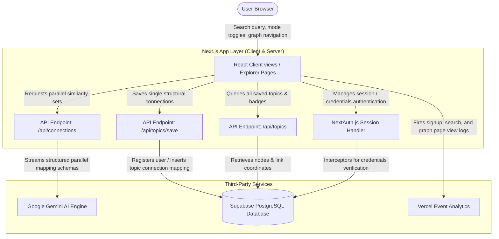
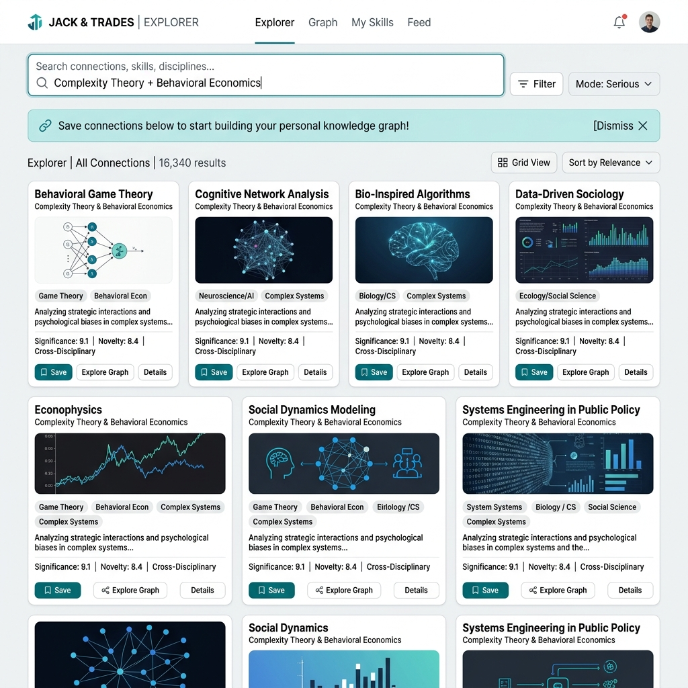
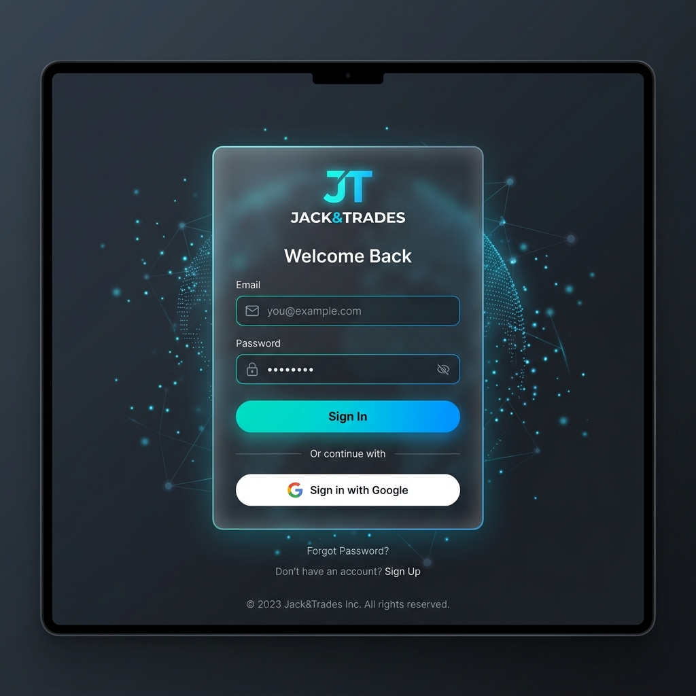
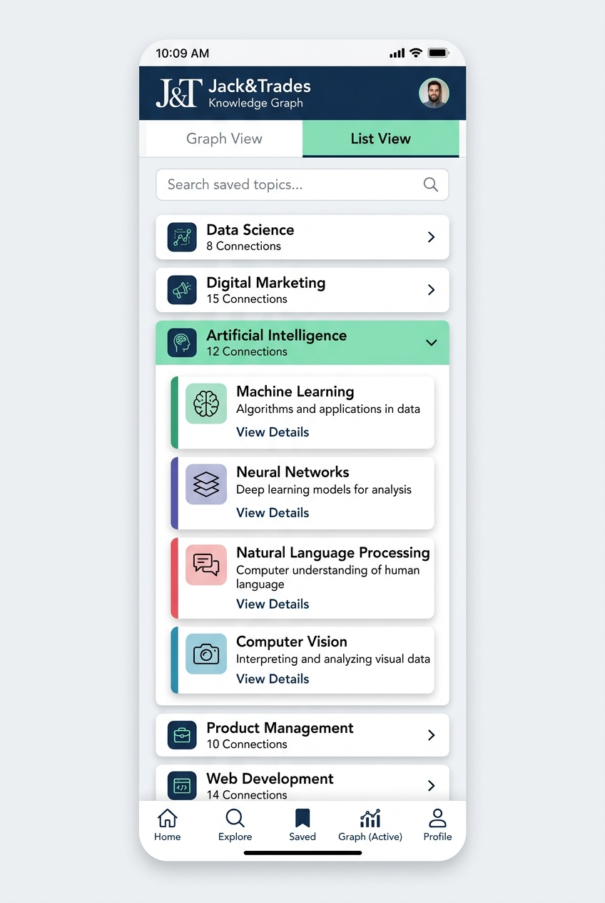

# Jack&Trades — The Polymath Engine 🧠

> *"A jack of all trades is a master of none, but oftentimes better than a master of one."*

**Jack&Trades** is an AI-powered cross-disciplinary knowledge explorer that helps you find deep, structural parallels between any concept (e.g. *Recursion*, *Supply & Demand*, *Photosynthesis*) and 16+ distinct fields of human thought (Science, Mathematics, Psychology, Philosophy, Economics, Art, Game Theory, Design, Music, Biology, and more).

---

## 🗺️ System Architecture

The following diagram maps out how the front-end router, session handlers, Gemini AI endpoints, and the Supabase database interact to discover, stream, and save cross-disciplinary similarities:



---

## 🎨 User Interface Preview

Here is how the main areas of the application look, featuring translucent glassmorphism, responsive grid layouts, and visual toggles:

| Explorer Search & Value Nudge | Credentials Log In Page | Mobile Accordion Fallback |
| :---: | :---: | :---: |
|  |  |  |

---

## 🌟 Key Features

1. **AI Parallel Generator**: Enter any topic to reveal mechanism-level similarities. Avoids shallow puns in favor of deep structural optimization, feedback loops, and state spaces.
2. **Serious & Playful Modes**:
   * **Serious**: Displays clean, rigorous mechanism parallels.
   * **Playful**: Highlights witty, screenshot-worthy fun facts with custom emojis and colorful callout boxes.
3. **Credentials Onboarding**: Secure, customized signup and sign-in credentials onboarding.
4. **Interactive D3.js Knowledge Graph**: Beautiful, interactive force-directed network showing saved topics clustering around shared disciplines. Click nodes to open connection sidecards.
5. **Mobile-Responsive Accordion Fallback**: If the viewport is smaller than `768px`, the D3 graph automatically degrades to an expandable accordion list of topics, guaranteeing accessibility on mobile devices.
6. **Ambient Atmospheric Motion**: Subtly drifting low-opacity color blobs and spotlight card hovers created using Framer Motion spring physics.
7. **Keep-Alive Scheduler**: Integrates `/api/auth/session` ping targets compatible with UptimeRobot to keep free-tier databases warm.

---

## 📁 Repository Structure

```text
├── app/                  # Next.js App Router Pages
│   ├── api/              # Route handlers for connection generation, saving, and auth
│   ├── knowledge-graph/  # D3 force-directed visual canvas & mobile fallback
│   ├── second-brain/     # Searchable/Filterable dashboard for saved topics
│   ├── login/ & signup/  # Authentication forms
│   ├── layout.tsx        # HTML wrapper containing Analytics and AmbientBlobs
│   └── page.tsx          # Homepage Explorer & client-side search content
├── components/           # Reusable layout and animated components
│   ├── AmbientBlobs.tsx  # Drifting background colored blobs
│   ├── SpotlightCard.tsx # Cursor spotlight hover tracker card wrapper
│   ├── MagneticButton.tsx# Spring physics magnetic button wrapper
│   ├── Navbar.tsx        # Persistent responsive header navbar
│   └── ConnectionCard.tsx# The card renderer for Serious/Playful mode parallels
├── lib/                  # Library utilities (NextAuth configuration, Supabase client)
├── supabase/             # SQL schema migrations and initial DDL definitions
├── public/               # Static preview assets, favicon icons, and preview card graphics
├── types/                # TypeScript core type interfaces
└── package.json          # Project script commands and package dependencies
```

---

## 🗄️ Database Schema

Jack&Trades uses **Supabase (PostgreSQL)**. Execute the SQL schema defined in [`supabase/schema.sql`](file:///d:/Projects/Jack&Trade/supabase/schema.sql) in your SQL editor. The schema outlines three tables:

### 1. `users` Table
Holds account logins (both credentials-based and OAuth-based).
| Column | Type | Constraints |
| :--- | :--- | :--- |
| `id` | UUID | PRIMARY KEY, Default: random_uuid() |
| `email` | VARCHAR | UNIQUE, NOT NULL |
| `password_hash` | VARCHAR | NOT NULL (oauth accounts get unique placeholder keys) |
| `created_at` | TIMESTAMP | DEFAULT: NOW() |

### 2. `topics` Table
Holds search categories created by users.
| Column | Type | Constraints |
| :--- | :--- | :--- |
| `id` | UUID | PRIMARY KEY, Default: random_uuid() |
| `user_id` | UUID | REFERENCES `users(id)` ON DELETE CASCADE |
| `title` | VARCHAR | NOT NULL |
| `created_at` | TIMESTAMP | DEFAULT: NOW() |
| **Unique Constraint** | `(user_id, title)` | Prevents duplicate topics for a single user |

### 3. `connections` Table
Holds individual saved cards/similarities nested under a topic.
| Column | Type | Constraints |
| :--- | :--- | :--- |
| `id` | UUID | PRIMARY KEY, Default: random_uuid() |
| `topic_id` | UUID | REFERENCES `topics(id)` ON DELETE CASCADE |
| `field` | VARCHAR | NOT NULL |
| `analogy` | TEXT | NOT NULL |
| `explanation` | TEXT | NOT NULL |
| `fun_fact` | TEXT | NOT NULL |
| `emoji` | VARCHAR | NOT NULL |
| `created_at` | TIMESTAMP | DEFAULT: NOW() |

---

## 🚀 Getting Started Locally

### 1. Clone & Install
```bash
git clone https://github.com/Saatvik-G/Jack-Trades.git
cd Jack-Trades
npm install
```

### 2. Configure environment variables
Create a `.env.local` file in your root folder:
```env
# Gemini API Key
GEMINI_API_KEY=your_gemini_api_key

# Supabase database keys
NEXT_PUBLIC_SUPABASE_URL=https://your-project.supabase.co
SUPABASE_SERVICE_ROLE_KEY=your_service_role_secret

# NextAuth secrets
NEXTAUTH_SECRET=your_jwt_signing_secret
NEXTAUTH_URL=http://localhost:3000

# (NextAuth automatically handles secure credentials tokens)
```

### 3. Run development build
```bash
npm run dev
```
Open [http://localhost:3000](http://localhost:3000) to view the application.

---

## 📄 License

MIT License © 2026 Jack&Trades
